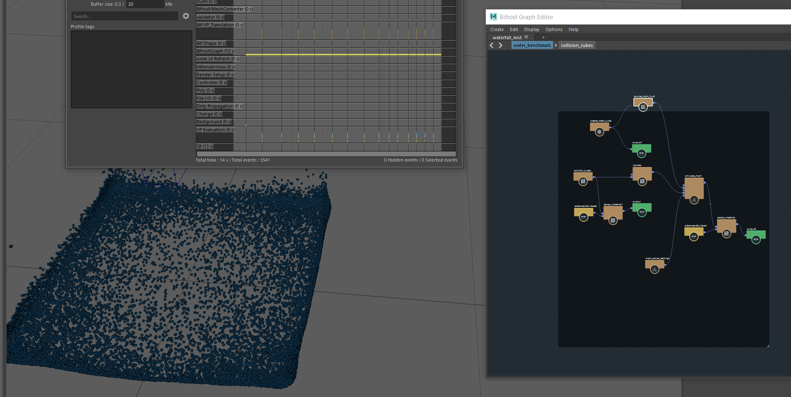
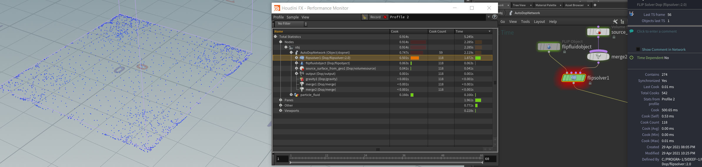
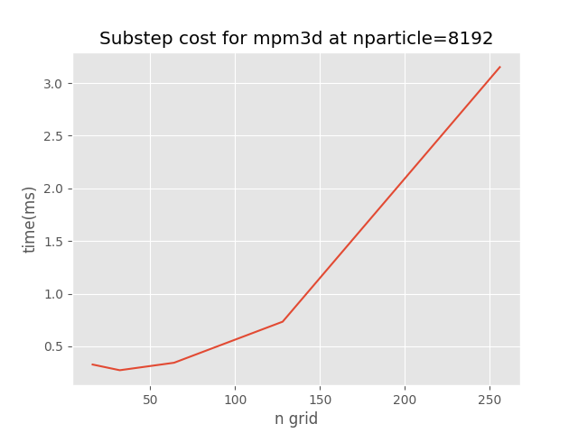
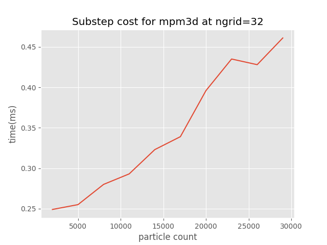

Fluid Simulation Benchmark
=====

This repo compare speed of 
- taichi MLS-MPM  
- houdini apic flip 
- maya bifrost graph  


## Basic setup
- 32 x 32 x 32 grid resolution
- ~8000 particles
- 1m x 1m x 1m container
- 0.1m x 0.1m x 0.1m particle source at position (0, 0.5, 0)
- gravity is set to (0, -9.8, 0)


## Speed Comparation
Measure result per substep:
- taichi cpu: ~2ms
- taichi gpu: ~0.28ms
- houdini: ~5ms
- maya: ~1000ms

hardware: CPU=AMD5900X, GPU=RTX2070  


## Simulation Preview
houdini:  
  
maya:  
  
taichi:  
  


### Houdini and Maya setup 
maya:  
  
houdini:  
  

### Possibility for realtime  
cost=2ms, substep=3:  
* ngrid = 32, n_particle = 60000  
* ngrid = 64, n_particle = 70000  
* ngrid = 128, n_particle = 0  

  
  

## Run Taichi profiling:
run:  
```python
python taichi_profiler.py
```