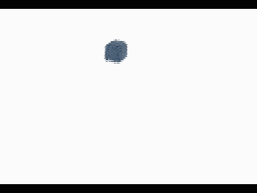

MPM Simulation Benchmark
=====

This repo compare speed of 
- taichi  
- houdini flip  
- maya bifrost graph  

## Basic setup
- 32 x 32 x 32 grid resolution
- ~8000 particles
- 1m x 1m x 1m container
- 0.1m x 0.1m x 0.1m particle source at position (0, 0.5, 0)
- gravity is set to (0, -9.8, 0)

## Speed Comparation
Measure result per substep:
- taichi cpu: ~2-4ms
- taichi gpu: ~1ms
- houdini: ~5ms
- maya: ~1000ms

## Simulation Preview
houdini:  
  
maya:  
  
taichi:  
  